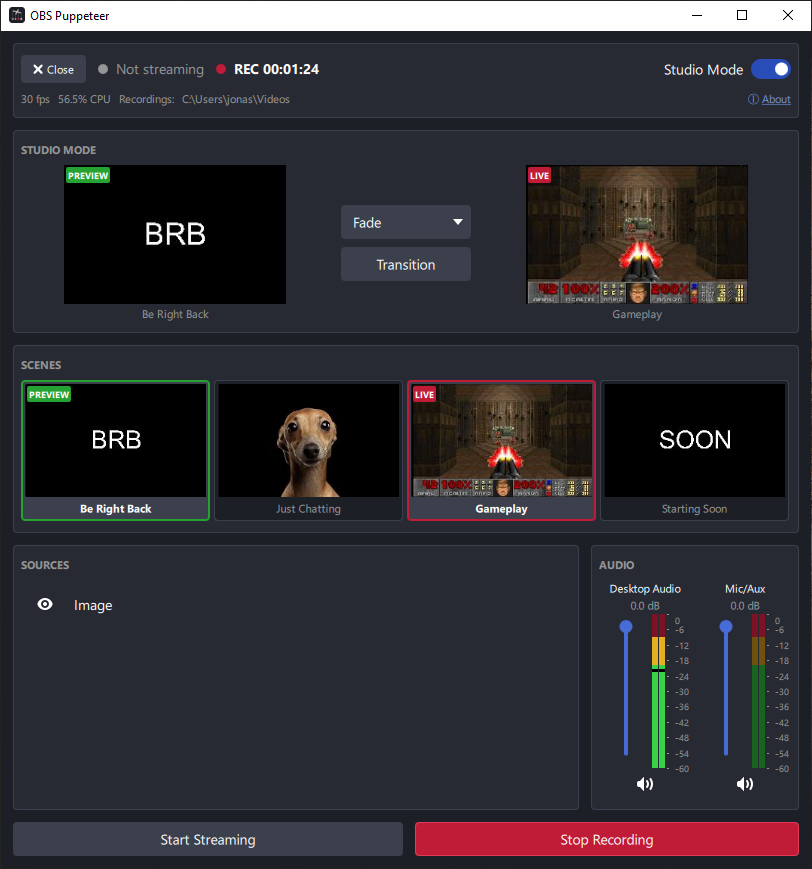

# OBS Puppeteer

A native desktop control panel for OBS Studio, built with Qt 6 / QML and
talking directly to [obs-websocket](https://github.com/obsproject/obs-websocket)
(bundled with OBS 28+).

**Disclaimer:**

- This is an unofficial, third-party tool. It is not affiliated with, endorsed
  by, or sponsored by the [OBS Project](https://github.com/obsproject/obs-studio)
  (Open Broadcaster Software), and is not part of OBS or developed by it.
- This project contains AI-generated code.

## Features

- Multi-platform. Tested on Windows and Linux.
- Scenes, with live preview thumbnails, switched with one click.
- The current scene's sources, with visibility toggles.
- Audio inputs: mute, volume with a dB readout, and live level meters.
- Streaming and recording: start, stop, and how long each has been running.
- Studio Mode: preview and program side by side, a transition picker and a
  transition button.
- OBS info: FPS, CPU, bitrate and skipped frames.

## Usage

### Installing

Download the latest build from the
[Releases](https://github.com/karjonas/obs-puppeteer/releases) page:

- **Linux**: `obs-puppeteer-<version>-x86_64.AppImage`. Make it executable
  (`chmod +x`) and run it.
- **Windows**: `obs-puppeteer-<version>-windows-x64.exe`. One file, nothing to
  install. It is unsigned, so SmartScreen warns on first run; choose *More info*
  then *Run anyway*.

Or build it from source; see [Building](CONTRIBUTING.md#building).

### Connecting

1. In OBS: Tools -> WebSocket Server Settings -> enable the server, note the port
   (default 4455) and password (if set).
2. Launch `obs-puppeteer`, enter host/port/password, click Connect.

Alternatively, skip the form with `--host`, `--port`, `--password` CLI flags.

The host box remembers addresses that have connected before and marks which are
reachable right now, so a machine that is switched off reads as such before you
pick it. The × beside an entry (or Shift+Delete) forgets that address. Unticking
**Remember this address** stops new addresses being saved; saved ones stay until
you remove them.

Any OBS from 28.0 onwards will do: every request and event this app makes has
been in the protocol since obs-websocket 5.0.0, which is the version OBS 28
shipped with.

### Security

**The password is never written to disk.** It lives only in memory: the field
you type it into, and one copy inside `ObsClient` so an unexpected drop can be
reconnected without asking again. What is stored is the host, the port, the
addresses you have connected to before, and whether to remember them:

- **Linux**: in `~/.config/obs-puppeteer/obs-puppeteer.conf`
- **Windows**: in the registry, under
  `HKEY_CURRENT_USER\Software\obs-puppeteer\obs-puppeteer`
- **macOS**: in `~/Library/Preferences/io.github.karjonas.obs-puppeteer.plist`

Beyond that, be aware of what the protocol itself does and does not protect:

- **Authentication is challenge–response.** obs-websocket 5.x salts and hashes
  the password per connection (SHA-256), so it is not sent in the clear and a
  captured handshake cannot be replayed against a new challenge.
- **Nothing else is encrypted.** The connection is plain `ws://`. Everything
  after the handshake — scene and source names, and the preview thumbnails,
  which are pictures of what OBS is showing — crosses the network in the clear.
  Over localhost that is between you and yourself. Over a LAN it is not.
- **`--password` on the command line is visible to other processes** on the
  same machine, through `/proc/<pid>/cmdline` and so `ps`. That is inherent to
  passing a secret as an argument, not specific to this app. The connection
  form avoids it.

## Contributing

Report bugs and request features by opening an
[issue](https://github.com/karjonas/obs-puppeteer/issues). Pull requests that
fix bugs are welcome; for a new feature, open an issue first. See
[CONTRIBUTING.md](CONTRIBUTING.md) for how to build, test and format the code.

## Copyright

- Copyright (C) 2026 Jonas Karlsson. GPL-3.0-or-later, see [LICENSE](LICENSE).
- OBS Studio's icons and Yami theme values: Copyright (C) OBS Studio
  contributors. GPL-2.0-or-later, see
  [ATTRIBUTION.md](resources/icons/obs/ATTRIBUTION.md).
- `.clang-format`: Copyright (C) 2016 Olivier Goffart. BSD-3-Clause.
- Qt, bundled in release builds: Copyright (C) The Qt Company Ltd. and other
  contributors. LGPL-3.0.

Licence texts are in [LICENSES/](LICENSES/); per-file details are in each
file's header and in [REUSE.toml](REUSE.toml).
